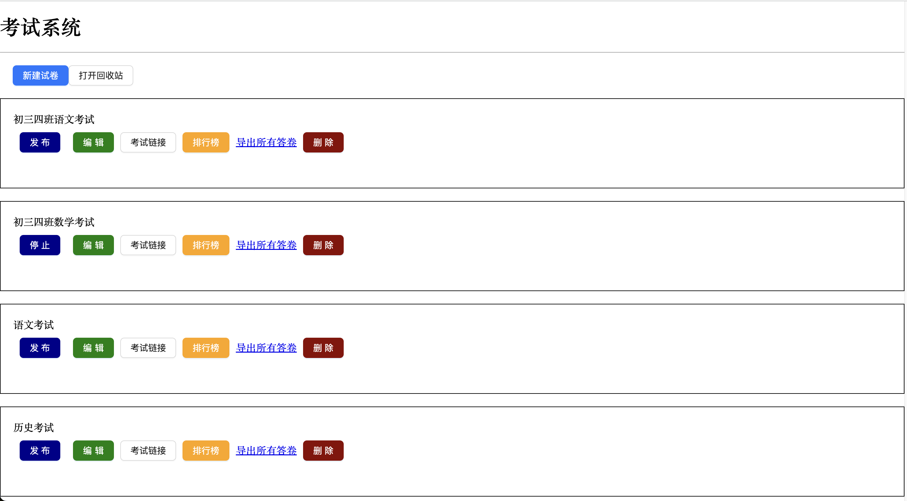
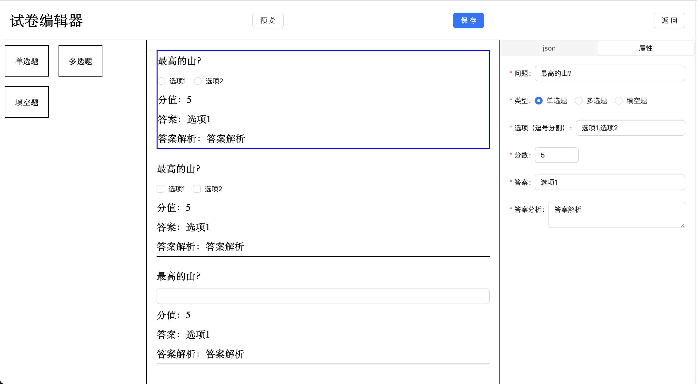

# 聊天室前端 (Exam System Frontend)

一个基于 React + TypeScript + Vite 构建的现代化在线聊天室前端应用。[后端项目在这](https://github.com/cyan0714/exam-system)




## ✨ 功能特性

### 👤 用户管理
- **用户注册** - 支持邮箱验证码注册
- **用户登录** - 安全的身份验证机制
- **密码管理** - 忘记密码重置功能

### 📝 试卷管理
- **试卷列表** - 查看所有可用试卷
- **试卷创建** - 创建新的考试试卷
- **试卷编辑** - 可视化试卷编辑器，支持拖拽操作
- **试卷发布** - 控制试卷的发布状态
- **试卷删除** - 支持软删除和回收站功能

### 📊 题目类型
- **单选题** - 支持多个选项的单选题
- **多选题** - 支持多个选项的多选题
- **填空题** - 支持文本输入的填空题

### 🎯 考试功能
- **在线考试** - 流畅的考试体验
- **实时答题** - 支持实时保存答案
- **成绩查看** - 考试结果和答案解析
- **排行榜** - 考试成绩排名展示
- **答卷导出** - 支持导出所有答卷数据

### 🛠️ 管理功能
- **试卷预览** - 发布前预览试卷效果
- **考试链接** - 生成考试链接供考生使用
- **答案解析** - 为每道题目提供详细解析
- **分值设置** - 灵活的题目分值配置

## 🚀 技术栈

### 核心框架
- **React 18** - 现代化的前端框架
- **TypeScript** - 类型安全的 JavaScript
- **Vite** - 快速的构建工具
- **Ant Design** - 企业级 UI 设计语言
- **React Router DOM** - 单页面应用路由管理
- **React DnD** - 强大的拖拽功能实现
- **Sass** - CSS 预处理器
- **Axios** - Promise 基础的 HTTP 库
- **ESLint** - 代码质量检查

## 📦 安装与运行

### 环境要求
- Node.js >= 20.0.0
- pnpm >= 7.0.0

### 快速启动
```bash
pnpm install
pnpm dev
```

## 🏗️ 项目结构

```
src/
├── assets/          # 静态资源
├── interface/       # API 接口定义
├── pages/           # 页面组件
│   ├── Login/       # 登录页面
│   ├── Register/    # 注册页面
│   ├── UpdatePassword/ # 修改密码页面
│   ├── ExamList/    # 试卷列表页面
│   ├── Edit/        # 试卷编辑页面
│   ├── Exam/        # 考试页面
│   └── Res/         # 考试结果页面
├── App.tsx          # 根组件
├── main.tsx         # 应用入口
└── index.css        # 全局样式
```

## 🔧 配置说明

### 后端服务配置
项目需要配合后端服务使用，默认配置：

- **用户服务**: `http://localhost:3001`
- **考试服务**: `http://localhost:3002`
- **答卷服务**: `http://localhost:3003`
- **排行榜服务**: `http://localhost:3004`

可在 `src/interface/index.tsx` 中修改后端服务地址。

## 🎨 功能使用指南

### 核心功能
1. **创建试卷**: 在试卷列表页点击"新建试卷"
2. **编辑试卷**: 使用拖拽方式添加题目，支持单选、多选、填空三种题型
3. **发布试卷**: 编辑完成后发布试卷供考生使用
4. **查看排行榜**: 查看考试成绩排名
5. **导出答卷**: 批量导出所有考生答卷

## 🤝 贡献指南

1. Fork 本仓库
2. 创建特性分支 (`git checkout -b feature/AmazingFeature`)
3. 提交更改 (`git commit -m 'Add some AmazingFeature'`)
4. 推送到分支 (`git push origin feature/AmazingFeature`)
5. 开启 Pull Request

## 📄 许可证

本项目采用 MIT 许可证 - 查看 [LICENSE](LICENSE) 文件了解详情。

