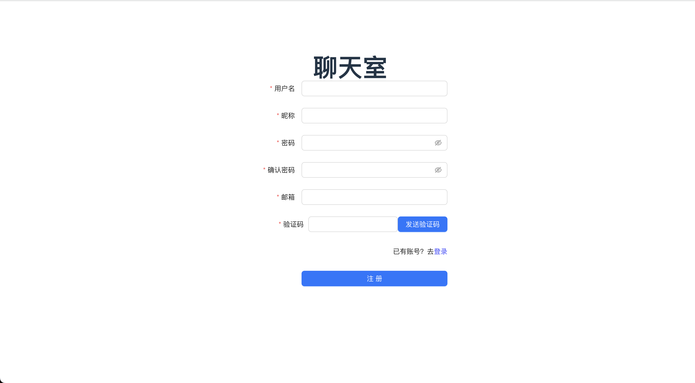
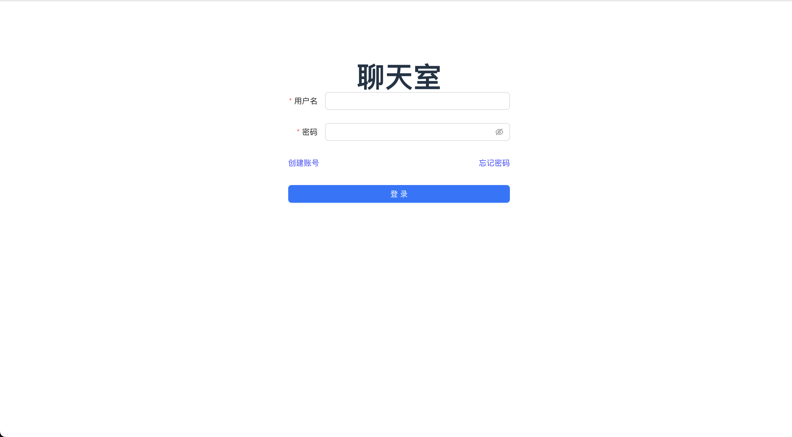
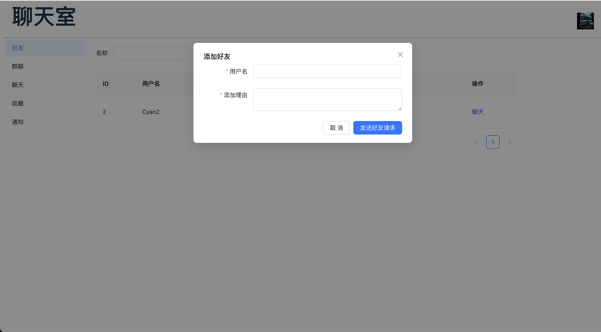
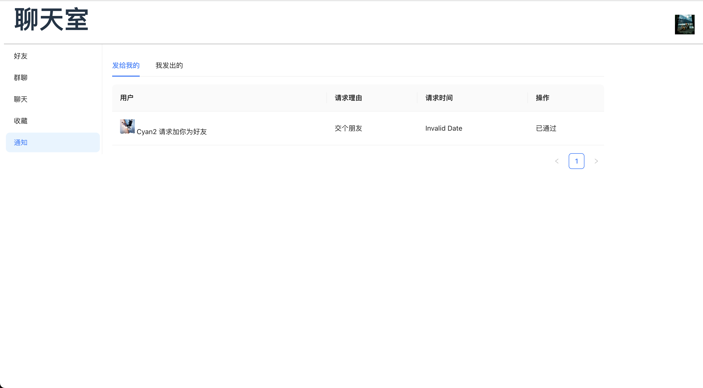
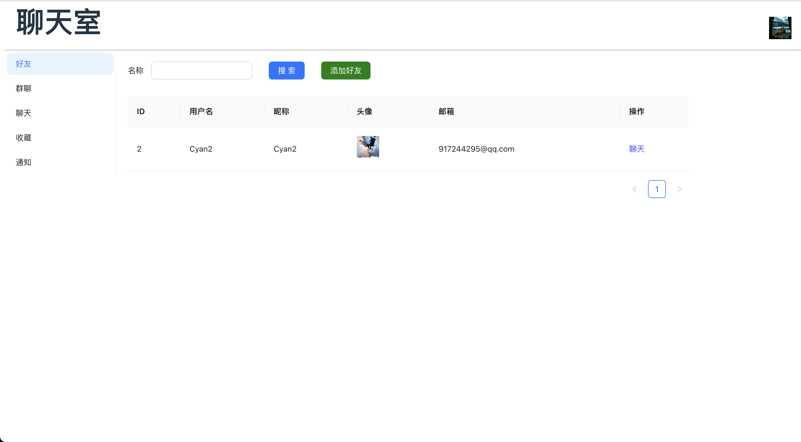
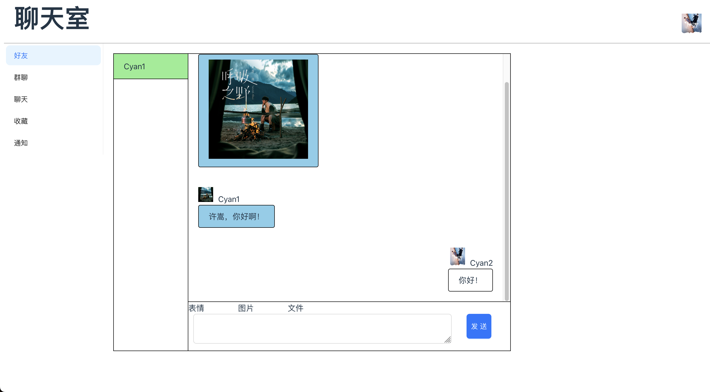
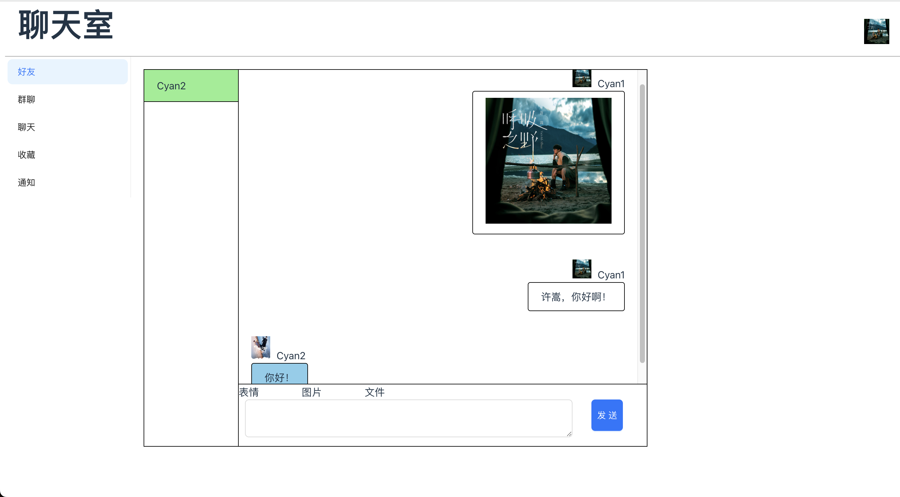

# 聊天室前端

基于 React + TypeScript + Vite 的现代化在线聊天室前端。支持用户注册、登录、好友管理、群聊、文件上传等功能。后端项目见：[chat-room-backend](https://github.com/cyan0714/chat-room-backend)


**注册**


**登录**


**添加好友**


**通知**


**好友列表**


**聊天**



## ✨ 主要功能

### 👤 用户与权限
- 用户注册（邮箱验证码）
- 用户登录与安全认证
- 密码重置与修改
- 个人信息与头像修改

### 💬 聊天与社交
- 单聊与群聊
- 好友添加、管理
- 群组创建、成员管理
- 文件上传与分享
- 通知与消息提醒

### 📊 其他
- 聊天记录持久化
- 实时消息推送
- 简洁的 UI

## 🚀 技术栈
- React 18
- TypeScript
- Vite
- Ant Design
- React Router DOM
- Sass
- Axios
- ESLint

## 📦 安装与启动
环境要求：
- Node.js >= 20.0.0
- pnpm >= 7.0.0

克隆项目后执行以下命令：
```bash
pnpm install
pnpm dev
```

## 🏗️ 项目结构

```
src/
├── assets/           # 静态资源
├── interface/        # API 接口与类型定义
├── pages/            # 页面组件
│   ├── Chat/         # 聊天主界面与文件上传
│   ├── Collection/   # 收藏/归档
│   ├── FriendShip/   # 好友管理
│   ├── Group/        # 群组管理
│   ├── Index/        # 首页/入口
│   ├── Login/        # 登录
│   ├── Menu/         # 菜单/导航
│   ├── Notification/ # 通知
│   ├── Register/     # 注册
│   ├── UpdateInfo/   # 个人信息修改
│   └── UpdatePassword/ # 密码修改
├── main.tsx          # 应用入口
└── index.css         # 全局样式
```


